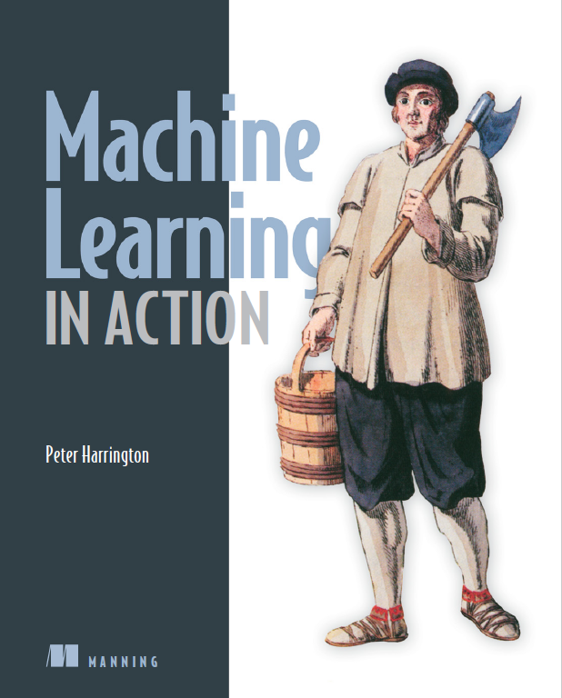

# Machine Learning in Action

## Learning Contents

### Classification 分类

- **Machine Learning Basics**

- **Classifying With k-Nearest Neighbors**

- **Splitting Datasets one feature at a Time: Decision Trees**

- **Classifying With Probability Theory: Naive Bayes**

- **Logistic Regression**

- **Support Vector Machines**

- **Improving Classification With the AdaBoost Meta-algorithm**

### Forecasting Numeric Values With Regression 利用回归预测数值型数据

- **Predicting Numeric Values: Rregression**

- **Tree-based Regression**

### Unsupervised Learning 无监督学习

- **Grouping Unlabeled Items Using k-Means Clustering**

- **Association Analysis With the Apriori Algorithm**

- **Efficiently Finding Frequent Itemsets With FP-growth**

### Additional Tools 其他工具

- **Using Principal Component Analysis (PCA) to Simplify Data**

- **Simplifying Data With the Singular Value Decomposition (SVD)**

- **Big Data & MapReduce**

