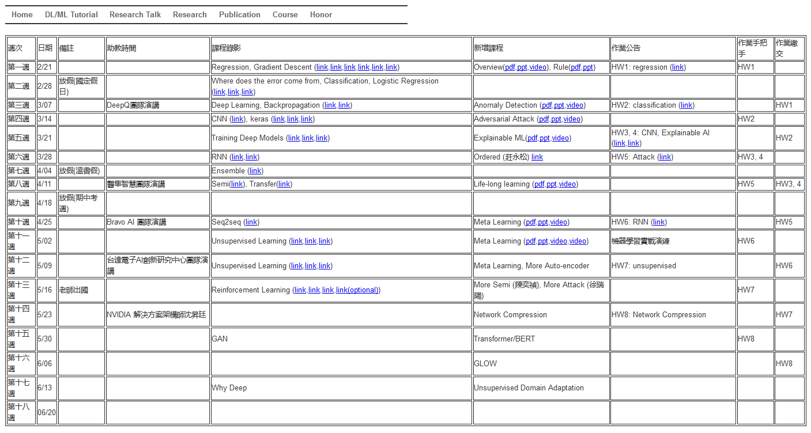

# 2019 机器学习课程

## [【课程主页(包含学习资料)】](http://speech.ee.ntu.edu.tw/~tlkagk/courses_ML19.html)

## [【课程视频(Bilibili)】](https://www.bilibili.com/video/av46561029/)

## [【YouTube】](https://www.youtube.com/playlist?list=PLJV_el3uVTsOK_ZK5L0Iv_EQoL1JefRL4)

### 课程目录

- 回归、梯度下降

- 分类、逻辑回归，错分类的原因

- 深度学习，反向传播（**Anomaly Detection 异常检测**）

- 卷积神经网络、Keras（**Attack & Defense 对抗样本攻击**）

- 训练深度学习模型（**Explainable/Interpretable AI 可解释 AI**）

- 循环神经网络（**Order LSTM**）

- Ensemble

- 半监督学习、迁移学习（**LLL 终身学习**）

- （**元学习**）

- seq2seq（**Transformer**）

- （**Few/Zero shot learning**）

- 无监督学习（**BERT**）

- 强化学习（**更细化**）

- （**网络压缩**）

- 生成对抗网络（**GLOW**）

- （**无监督域适应**）

- 为什么要使用深度学习（**深度学习理论**）
